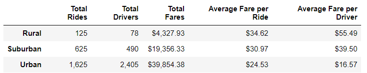
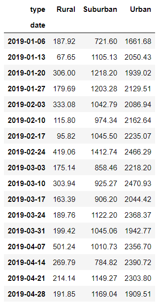
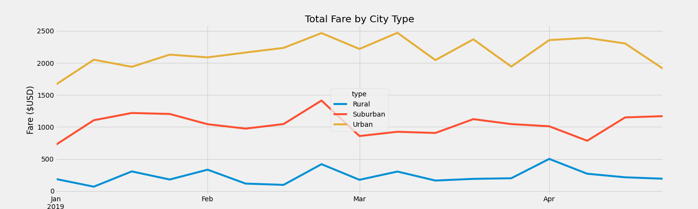

# Pyber_Analysis
## Purpose
Create a summary DataFrame of the ride-sharing data by city type then create a multiple-line gpraph showing total weekly fares for each city type.

Using the summary, we can help the decision-makers by analyzing rideshare data at Pyber from January to late April of 2019 in order to improve access to ride-sharing services and determine affordability for underserves neighborhoods.


## Analysis
### Dependencies
There are two denpendencies for our program.The first is **_matplotlib.pyplot_** import necessary for us to create our visuals for presentation. Second, we imported **_pandas_** in order to make our DataFrame. (below)

```ipynb:PyBer_Challenge.ipynb[1]
import matplotlib.pyplot as plt
import pandas as pd
```

### Data Files
We were provided the data files under "Resources" folder named "city_data.csv" and "ride_data_csv." We created a big dataset by merging the two that contained all the informations we need to deliver our analysis.


### A Ride-Sharing Summary DataFrame


We obtain the above DataFrame by using various **groupby()** functions, chaining with **count()** and **sum()**, to create this DataFrame.

### A Multiple-Line Chart of Total Fares for Each City Type**
Using our DataFrame create from Pandas, we utilized two functions, **pivot()** and **resample**, to create a pivot table with selected indexes. The function **loc()** was used to select a specific timeframe we are looking for (Jan 1, 2019 to April 28, 2019).


```ipynb:PyBer_Challenge.ipynb[16]
pd.to_datetime()
```
This line of code is used to convert our "date" index into a datetime datatype necessary for our **resample()** function, giving us the following:



Finally, we plotted our resample DataFrame using th object-oriented method, with title and labels on each axis. **(below)**


### Result
There are clear differences between ride-sharing data among the different city types.
- Total Rides, Total Drivers, and Totadl Fares in Urban cities surpass that of Suburban and Rural cities.
	- **Urban > Suburban > Rural in terms of total rides/drivers/fares**
- The Average Fare per Ride and Average Fare per Driver are much lower in Urban cities then Suburban and Rural cities.
	- **Rural > Suburban > Urban in terms of average fare per ride/driver**


**There are three recommendations to the CEO to solve the disparities among the city types:**
1. Increase the number of drivers in Rural and Suburban cities to offset the lower numbers of total drivers available in those two city types. Increasing the amount of drivers should increase the total rides and total fares.

2. Decrease the average fare per driver. Rural city drivers costs 3 times more than that of Urban cities. Similiarly, Suburban city drivers costs more than double compare to Urban cities.

3. Lastly, there is nothing to be done since it is a matter of supply and demand. This analysis is to be expected since there is a higher volume of people and traffic in places where people work and meet, which in turn is directly proportional with total rides/drivers/fares. More people equates to more need for the ride-sharing service, causing the average fare per ride/driver to decrease. These disparities is to be expected.

